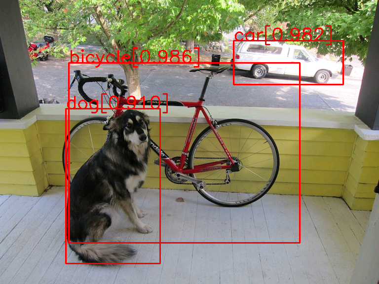

# my_ssd

Simple implementation of YOLO(You only look at once). Still can't work now, to be continued...
____
<!-- ## Example

____
## Performance

### Evalution on VOC 2007 test
#### mAP
| Method | Training Data | Mine | Paper |
|:-: |:-:|:-:|:-:|
| SSD300 | VOC 2007 trainval | 60.3% | 68.0% |


#### ,,,
There is room for improvement...
____
## DEMO
### 1.Enviromental dependencies
requires pytorch >=0.41
- python3 is better
- install [pytorch](https://pytorch.org)
  ```shell
   # make sure pip3 is upgraded
   pip3 install torch torchvision
  ```
- install [chainercv](https://github.com/chainer/chainercv), following their
instructions, or you can install from pip
    ```shell
    pip3 install chainercv
    ```
- install opencv
    ```shell
    pip3 install opencv-python
    ```
- other libs: tqdm, PIL...

### 2.Train
#### pretrained model
- you can download the model at https://github.com/chenyuntc/simple-faster-rcnn-pytorch , I use the pretrained model of the link given by his repository, thank the author here.
- or you can modify `use_caffe=False` in config/config.py to use the torchvision models...
#### command
Train the model with:
```shell
python3 main.py train
```
### 3.Test
Show the `dog` detection example by:
```shell
python3 main.py test
```
### 4.Eval
Evalute the model on VOC 2007 test by:
```shell
python3 main.py eval
```
____
-->
## TODO

- [-] Roughly Implementation:
    - [-] train basicly
    - [-] catch up performance reported in paper- 
    - [-] train on coco    

## References:
+ [You Only Look Once: Unified, Real-Time Object Detection(Paper)](https://arxiv.org/abs/1506.02640)
+ [YOLO9000: Better, Faster, Stronger(Paper)](https://arxiv.org/abs/1612.08242)
+ [YOLOv3: An Incremental Improvement(Paper)](https://arxiv.org/abs/1804.02767)
+ [pjreddie/darknet](https://github.com/pjreddie/darknet)
+ [marvis/pytorch-yolo3](https://github.com/marvis/pytorch-yolo3) 